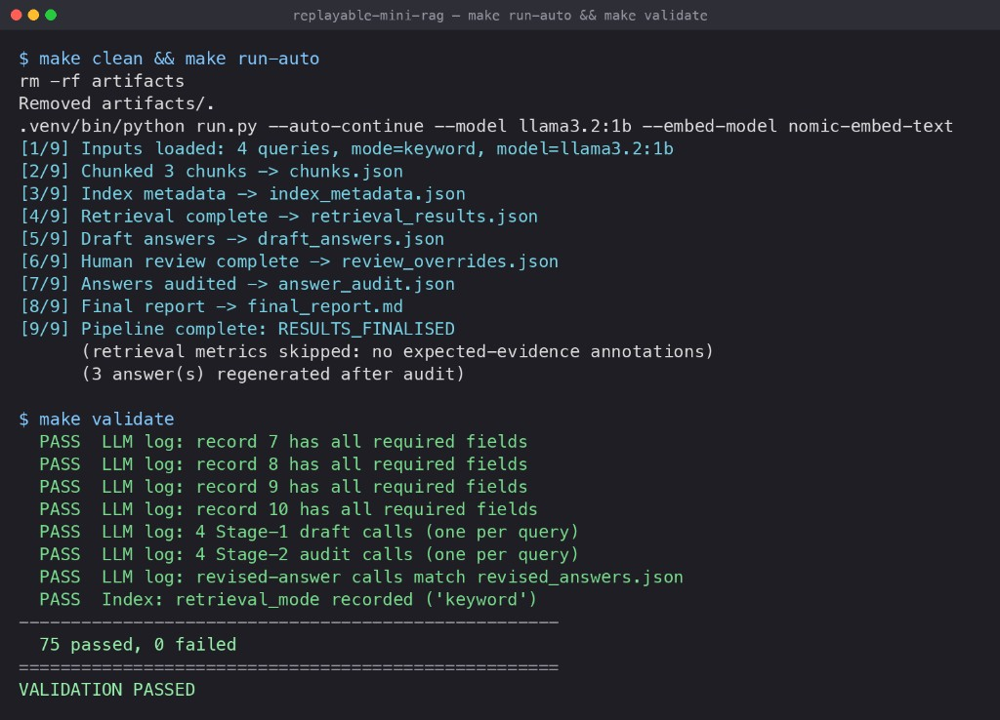

# Replayable Mini RAG Pipeline

A small, **replayable** retrieval-augmented-generation pipeline that ingests a
document corpus and a query set from disk, performs **deterministic** chunking
and retrieval, generates **grounded** draft answers with citations, pauses for a
**human-review override** checkpoint, runs a **second-stage audit** of each
answer, and produces a **final evaluation report**.

It is intentionally *not* a one-shot chatbot. The pipeline:

- separates **retrieval** from **generation** from **audit**,
- preserves every intermediate artifact on disk,
- logs every LLM call to `llm_calls.jsonl`,
- makes unsupported / weakly-supported answers clearly visible, and
- can be re-run from a clean checkout to regenerate all artifacts.

LLM calls are served by a **local [Ollama](https://ollama.com)** instance.
Retrieval defaults to a deterministic in-code **BM25** ranker, with an
**embedding** mode (Ollama embeddings) selectable by config.

---

## Requirements

- Python 3.10+
- [Ollama](https://ollama.com) installed and running (`ollama serve`)
- Models pulled locally (handled by `make setup`):
  - generation: `llama3.1:8b` (override with `LLM_MODEL`; a lighter option is `llama3.2:3b`)
  - embeddings: `nomic-embed-text` (only needed for `embedding` retrieval mode)

## Quick start

```bash
make setup        # venv + deps + ollama pull (LLM + embedding models)
make run          # full pipeline, interactive human-review checkpoint
make validate     # check all artifacts against the requirements
```

For automation / CI (non-interactive, no overrides):

```bash
make run-auto     # equivalent to: python run.py --auto-continue
make validate
```

Prove regeneration from scratch:

```bash
make clean        # delete artifacts/
make run-auto
make validate
```

## Inputs (read from disk)

The pipeline reads three inputs and does **not** depend on exact filenames,
document wording, chunk ordering, or expected answers:

- `documents/` — a directory of `.txt` files (the corpus)
- `queries.json` — the query set
- `policy.json` — retrieval + answer policy (see below)

Paths are overridable on the CLI:

```bash
python run.py \
  --documents documents \
  --queries queries.json \
  --policy policy.json \
  --out artifacts \
  --mode keyword            # or: embedding (overrides policy.json)
```

### `policy.json`

```json
{
  "retrieval": {
    "mode": "keyword",
    "top_k": 3,
    "chunk_size_chars": 480,
    "chunk_overlap_chars": 80
  },
  "allowed_labels": ["supported", "partially_supported", "unsupported"],
  "citation_required": true,
  "forbidden_behaviours": [
    "Do not present outside knowledge as corpus-grounded fact.",
    "Do not cite chunks that were not provided as context.",
    "Do not claim support when the context is silent or ambiguous."
  ],
  "generation": { "provider": "ollama", "model": "llama3.1:8b" }
}
```

### `queries.json`

```json
{
  "queries": [
    { "query_id": "Q1", "question": "How long is event data retained on the standard plan?" }
  ]
}
```

Optional: each query may carry expected-evidence annotations to enable
deterministic retrieval metrics (recall@k / hit@k). Either form is accepted:

```json
{ "query_id": "Q1", "question": "...", "expected_chunk_ids": ["product_overview-0000"] }
{ "query_id": "Q1", "question": "...", "expected_documents": ["product_overview.txt"] }
```

If annotations are absent, metrics are skipped gracefully.

## Pipeline stages

The pipeline enforces this order in code (illegal transitions raise):

```
INIT -> INPUTS_LOADED -> DOCUMENTS_CHUNKED -> INDEX_BUILT
     -> RETRIEVAL_COMPLETE -> DRAFT_ANSWERS_GENERATED -> HUMAN_REVIEW_COMPLETE
     -> ANSWERS_AUDITED -> FINAL_REPORT_GENERATED -> VALIDATION_COMPLETE
     -> RESULTS_FINALISED
```

1. **Deterministic chunking + index build** — code-only; no LLM involved.
2. **Retrieval** — per query, top-k chunks (BM25 or embedding), reproducible.
3. **Draft answers (Stage 1 LLM)** — one call per query, grounded in retrieved chunks.
4. **Human review checkpoint** — override retrieved chunks per query before audit.
5. **Answer audit (Stage 2 LLM)** — one call per query, on the post-override context.
6. **Final report** — `final_report.md`.
7. *(should)* Deterministic retrieval metrics, if annotations exist.
8. *(should)* Regenerated, more conservative answers for failed/high-risk audits.
9. *(stretch)* Retrieval error analysis.
10. *(stretch)* Configurable retrieval mode (keyword / embedding).

## Generated artifacts (in `artifacts/`)

| File | Stage |
|------|-------|
| `chunks.json` | chunking |
| `index_metadata.json` | index build (records retrieval mode) |
| `retrieval_results.json` | retrieval |
| `draft_answers.json` | Stage 1 |
| `review_overrides.json` | human review |
| `answer_audit.json` | Stage 2 |
| `final_report.md` | report |
| `retrieval_metrics.json` | if annotations present |
| `revised_answers.json` | if any audit fail / high risk |
| `retrieval_error_analysis.json` | stretch |
| `llm_calls.jsonl` | every LLM call |
| `pipeline_state.json` | stage transition log |

## Sample run (local, Ollama `llama3.2:1b`)

The screenshot below is an actual local execution of `make run-auto` followed by
`make validate` (lightweight `llama3.2:1b` model):



Transcript for reference:

```text
$ make clean && make run-auto
rm -rf artifacts
Removed artifacts/.
.venv/bin/python run.py --auto-continue --model llama3.2:1b --embed-model nomic-embed-text
[1/9] Inputs loaded: 4 queries, mode=keyword, model=llama3.2:1b
[2/9] Chunked 3 chunks -> chunks.json
[3/9] Index metadata -> index_metadata.json
[4/9] Retrieval complete -> retrieval_results.json
[5/9] Draft answers -> draft_answers.json
[6/9] Human review complete -> review_overrides.json
[7/9] Answers audited -> answer_audit.json
[8/9] Final report -> final_report.md
[9/9] Pipeline complete: RESULTS_FINALISED
      (retrieval metrics skipped: no expected-evidence annotations)
      (3 answer(s) regenerated after audit)

$ make validate
  ... (per-artifact and per-query PASS checks) ...
  PASS  LLM log: 4 Stage-1 draft calls (one per query)
  PASS  LLM log: 4 Stage-2 audit calls (one per query)
  PASS  LLM log: revised-answer calls match revised_answers.json
  PASS  Index: retrieval_mode recorded ('keyword')
----------------------------------------------------
  75 passed, 0 failed
====================================================
VALIDATION PASSED
```

> Note: `llama3.2:1b` is tiny and fast but produces weaker answer text; the
> pipeline correctly catches low-quality drafts at the audit stage and
> regenerates more conservative answers. A larger model (e.g. `llama3.1:8b`)
> yields better answer content with identical pipeline behaviour.

## Validation

```bash
make validate     # or: python validate.py
```

`validate.py` checks that required artifacts exist and parse, inputs were read
from disk, chunking happened before any LLM call, every query has retrieval
results, every draft label is in `policy.allowed_labels`, draft citations refer
only to that query's retrieved chunks, each query has its own Stage-2 audit call,
audit ran after human review, overrides were saved and applied to audit inputs,
the report reflects the final (post-override) context, and `llm_calls.jsonl`
contains separate records for the required stages.

## Testing & coverage

```bash
make test                                   # run the unit suite
.venv/bin/python -m pytest --cov=src/minirag --cov=run --cov=validate \
    --cov-report=term-missing               # with a coverage report
```

The suite has **97 tests** across every module and runs fully offline — the
Ollama client is replaced by a deterministic `fake_ollama` fixture
(`tests/conftest.py`), so no model download or running server is required. It
includes a full pipeline integration test (`INIT → RESULTS_FINALISED` on
temporary fixtures) plus `validate.py` happy-path and failure-injection tests.

Latest run: **97 passed, 93% line coverage** (`pytest-cov`).

| Module | Coverage | Tested by |
|---|---|---|
| `schemas.py` | 100% | `test_schemas.py` |
| `paths.py` | 100% | `test_paths.py` |
| `indexing.py` | 100% | `test_indexing.py` |
| `prompts.py` | 100% | `test_prompts.py` |
| `audit.py` | 100% | `test_audit.py` |
| `pipeline.py` | 99% | `test_pipeline.py` |
| `generate.py` | 97% | `test_generate_validation.py` |
| `retrieval.py` | 97% | `test_retrieval.py`, `test_retrieval_embedding.py` |
| `review.py` | 96% | `test_review.py` |
| `report.py` | 95% | `test_report.py` |
| `metrics.py` | 95% | `test_metrics.py` |
| `revise.py` | 95% | `test_revise.py` |
| `run.py` | 95% | `test_run_cli.py` |
| `io_utils.py` | 94% | `test_io_utils.py` |
| `chunking.py` | 92% | `test_chunking.py` |
| `error_analysis.py` | 92% | `test_error_analysis.py` |
| `state.py` | 89% | `test_state.py` |
| `llm.py` | 85% | `test_llm.py` |
| `validate.py` | 81% | `test_validate.py` |
| **Total** | **93%** | 97 tests |

## Determinism notes

Chunking and retrieval are fully deterministic in code (stable IDs, fixed
windows, deterministic tie-breaking). LLM calls use `temperature=0, seed=42,
top_k=1, top_p=1` and a large context window for **best-effort** reproducibility;
exact token-level determinism across hardware is not guaranteed by Ollama.

## Security & performance

The pipeline treats the corpus and query set as **untrusted input** and bounds
the work it does on them. The following hardening is built in:

### Security

- **Prompt-injection resistance.** Document and question text is interpolated
  into LLM prompts, so it is treated as *data, not instructions*. The
  generation, audit, and revision system prompts (`src/minirag/prompts.py`)
  carry an explicit guardrail telling the model to ignore any embedded
  instructions that try to change its task, output schema, allowed labels, or
  policy, and every context chunk is wrapped in `BEGIN/END chunk_id` markers so
  corpus content is clearly delimited from developer instructions. This reduces
  (but, as with any RAG system, cannot fully eliminate) injection risk.
- **Bounded corpus ingestion (memory-DoS guard).** Chunking enforces a
  per-document size cap so a single oversized or malicious `.txt` cannot exhaust
  memory. The default is 10 MiB; override it with the `MINIRAG_MAX_DOC_BYTES`
  environment variable (`0` disables the check):

  ```bash
  MINIRAG_MAX_DOC_BYTES=52428800 make run-auto   # allow up to 50 MiB per doc
  ```
- **Output discipline.** Structured LLM output is constrained to a pydantic JSON
  schema, labels are coerced to `policy.allowed_labels`, and citations are
  filtered to the chunks actually in scope — fabricated labels/citations from the
  model are dropped rather than trusted.
- **No dynamic execution.** No `eval`/`exec`/`subprocess`/`pickle`/`yaml.load`;
  all artifact writes are atomic (temp file + `os.replace`) so a crash never
  leaves a half-written file that could fool the validator.

### Performance

- **Cached BM25 IDF.** Inverse document frequency is precomputed once per term at
  index-build time instead of being recomputed (with its `math.log`) for every
  `(document, query-term)` pair at score time. Ranking output is byte-for-byte
  unchanged; only redundant work is removed.
- **Batched embeddings.** In `embedding` mode the corpus is embedded in a single
  batched request when the Ollama client supports it, instead of one HTTP
  round-trip per chunk, with a graceful fallback to the per-text endpoint for
  older clients. Retrieval stays deterministic.

These behaviours are covered by the unit tests in `tests/` (`make test`).

## Project layout

```
replayable-mini-rag/
  documents/                 # sample corpus (.txt)
  queries.json               # sample queries
  policy.json                # retrieval + answer policy
  run.py                     # pipeline entry point
  validate.py                # validation gate
  Makefile
  requirements.txt
  src/minirag/
    state.py                 # stage state machine
    io_utils.py              # disk IO, atomic writes, prompt hashing
    schemas.py               # pydantic models
    chunking.py              # deterministic chunking
    indexing.py              # index metadata
    retrieval.py             # BM25 + embedding retrieval
    llm.py                   # Ollama wrapper + llm_calls.jsonl logging
    prompts.py               # prompt construction + injection guardrails
    generate.py              # Stage 1 draft answers
    review.py                # human review checkpoint
    audit.py                 # Stage 2 audit
    revise.py                # conservative re-generation
    metrics.py               # retrieval metrics
    error_analysis.py        # retrieval error analysis
    report.py                # final_report.md
    pipeline.py              # orchestration
  tests/                     # pytest unit tests
```

